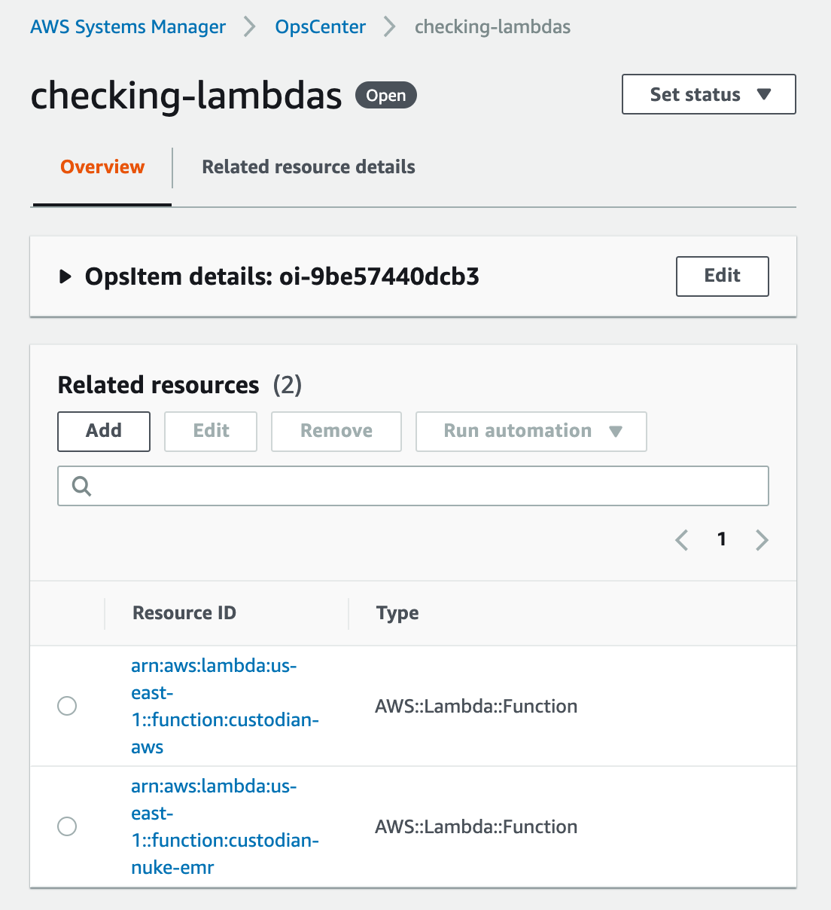

# AWS Systems Manager

## EC2 Systems Manager

Cloud custodian enables several use cases with SSM.

> -   Filtering instances on the basis of their association to SSM. See
>     `ssm filter <aws.ec2.filters.ssm>`{.interpreted-text role="ref"}
> -   Executing actions on instances with an ssm agent installed. See
>     `ec2 send command action <aws.ec2.actions.send-command>`{.interpreted-text
>     role="ref"}

## Ops Center

AWS Systems Manager Ops Center is an operations dashboard that provides
a central location to collect, triage, and remediate operation issues
related to resource in an AWS account. It automatically pulls in
contextual information from Cloud Trail and AWS Config to enable easier
triage.

For more details on Ops Center see.
<https://docs.aws.amazon.com/systems-manager/latest/userguide/OpsCenter.html>

Cloud Custodian has deep support for integrating with SSM Ops Center.
With custodian you can.

> -   Filter resources by extant ops items associated to them. See
>     `ops-item filter <aws.common.filters.ops-item>`{.interpreted-text
>     role="ref"}
> -   Post new ops items for a resource from any custodian policy. See
>     `post-item action <aws.common.actions.post-item>`{.interpreted-text
>     role="ref"}
> -   Manage ops items as a resource, to resolve or update ops items.
>     See `ops-item resource <aws.ops-item>`{.interpreted-text
>     role="ref"}

## OmniSSM

Custodian project maintains a tool OmniSSM for enabling cross account,
and cross cloud provider systems manager setups using the data
center/hybrid mode support of SSM. It provides for secure introduction
(using signed metadata documents), automated discovery and garbage
collection using a set of golang lambda functions.

See tools section of the docs for more info.
